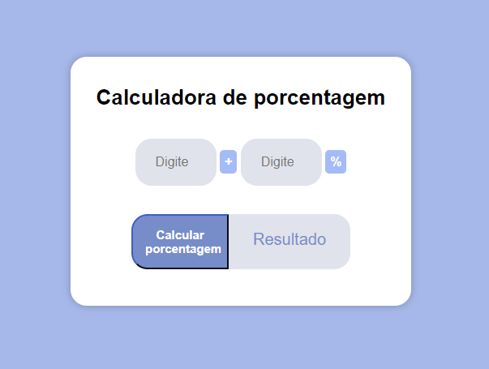

# Calculadora de Porcentagem

  

Demonstração da tela

## Sobre

Este é um projeto simples de uma Calculadora de Porcentagem utilizando HTML, CSS e JavaScript. Ele consiste em calcular o valor acrescido de uma porcentagem que o usuário deverá informar. A interfaze foi desenvolvida utilizando as tecnologias HTML e CSS, e a lógica de cálculo foi aplicada com JavaScript. 

## Tecnologias Utilizadas

- HTML
- CSS
- JavaScript
